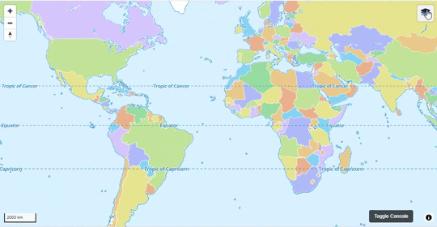
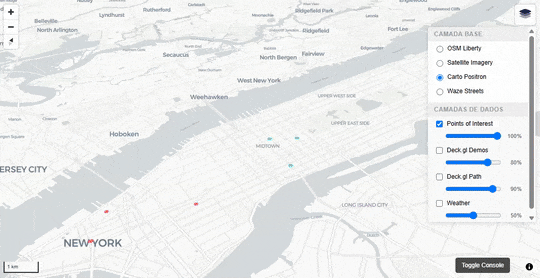

# LayersControl — MapLibre Layer Manager

A compact, modern, and extensible layer control for MapLibre GL JS, designed for production apps needing:

- Fast, testable code with clear separation of concerns
- Flexible UX: grouping, per-overlay and group opacity, pan-on-add
- Dynamic data loading via `renderOnClick` (async overlays)
- Deck.gl integration for high-performance overlays
- State persistence (base, overlays, opacity, order, viewport)
- Event-driven API for analytics, telemetry, or custom UI




---

## Features

- Base map switching (`setStyle` or `toggleBackground` strategies)
- Overlay grouping and group-level opacity
- Per-overlay opacity sliders and status indicators (loading/error/zoom-filtered)
- `panOnAdd`: fly to overlay location on enable
- `renderOnClick`: async remote overlay loader (with caching and retry)
- State persistence: base, overlays, opacity, order, viewport (via `localStorage`)
- Event system for all state changes and overlay lifecycle
- Works with MapLibre and optionally deck.gl

---

## Installation

Include MapLibre GL JS, deck.gl, LayersControl JS, and CSS in your page:

```html
<script src="https://unpkg.com/maplibre-gl/dist/maplibre-gl.js"></script>
<script src="https://unpkg.com/deck.gl/dist.min.js"></script>
<script src="path/to/layers-control.js"></script>
<link rel="stylesheet" href="path/to/main.css">
```

---

## Usage (Minimal Example)

```javascript
const baseStyles = [
  { id: 'osm', label: 'OpenStreetMap', style: 'https://demotiles.maplibre.org/style.json', strategy: 'setStyle' }
];

const overlays = [
  {
    id: 'traffic',
    label: 'Traffic Flow',
    deckLayers: [
      {
        id: 'traffic-lines',
        type: 'LineLayer',
        props: {
          data: [ /* your line data */ ],
          getSourcePosition: d => d.from,
          getTargetPosition: d => d.to,
          getColor: [255,0,0],
          getWidth: 2
        }
      }
    ],
    opacityControls: true,
    defaultVisible: false
  }
];

const layersControl = new LayersControl({
  baseStyles,
  overlays,
  defaultBaseId: 'osm',
  persist: { localStorageKey: 'my-app-layers' },
  position: 'top-right'
});

const map = new maplibregl.Map({
  container: 'map',
  style: LayersControl.getInitialStyle({
    baseStyles,
    defaultBaseId: 'osm',
    persist: { localStorageKey: 'my-app-layers' }
  }) || baseStyles[0].style,
  center: [0, 0],
  zoom: 2
});

map.on('load', () => {
  layersControl.addTo(map);
  const vp = LayersControl.getInitialViewport({ persist: { localStorageKey: 'my-app-layers' } });
  if (vp) map.jumpTo(vp);
});
```

---

## Configuration

See [docs/CONFIGURATION.md](docs/CONFIGURATION.md) for all options and persisted state schema.

- `baseStyles`: Array of base map styles (id, label, style, strategy)
- `overlays`: Array of overlays (id, label, group, deckLayers, renderOnClick, opacityControls, etc.)
- `groups`: Optional array for overlay grouping
- `persist`: `{ localStorageKey }` for state persistence
- `position`: MapLibre control position
- `i18n`: Label translation function
- `autoClose`, `showOpacity`, `showLegends`: UI options

---

## Supported Overlay Types

- Only `deckLayers` and `renderOnClick` overlays are supported.
- MapLibre `source`/`layers` overlays are NOT supported.

See [docs/RENDER_ON_CLICK.md](docs/RENDER_ON_CLICK.md) for the dynamic overlay contract.

---

## Events

LayersControl emits events for all state changes and overlay lifecycle:

- `basechange`, `overlaychange`, `overlaygroupchange`, `change`
- `loading`, `success`, `error`
- `styleload`, `sourceloaded`, `viewportchange`, `zoomfilter`, `memorycleared`

See [docs/EVENTS.md](docs/EVENTS.md) for event payloads and usage.

---

## Persistence

- State is saved to `localStorage` under the configured key.
- Persisted: baseId, overlays (visibility, opacity), groups, layerOrder, viewport.

---

## CSS Customization

All UI classes are defined in [src/css/main.css](src/css/main.css).  
Override these classes in your own CSS for custom themes or layout.

See [docs/CSS.md](docs/CSS.md) for a full class reference.

---

## Reference & Further Documentation

- [docs/QUICKSTART.md](docs/QUICKSTART.md): Quickstart and minimal examples
- [docs/API_REFERENCE.md](docs/API_REFERENCE.md): Full API and method signatures
- [docs/CONFIGURATION.md](docs/CONFIGURATION.md): Options schema and persisted state
- [docs/RENDER_ON_CLICK.md](docs/RENDER_ON_CLICK.md): Dynamic overlays contract
- [docs/EVENTS.md](docs/EVENTS.md): Emitted events and payloads
- [docs/CSS.md](docs/CSS.md): CSS class names and styling
- [docs/WORKFLOWS.md](docs/WORKFLOWS.md): Runtime workflows
- [docs/ARCHITECTURE.md](docs/ARCHITECTURE.md): Internal design and responsibilities

---

## License

MIT (see LICENSE)
